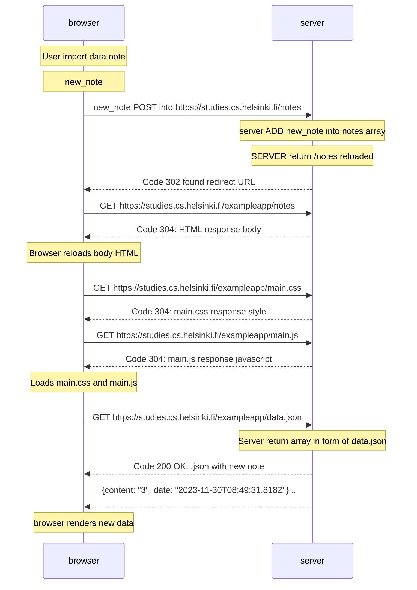

#Note: part0.4

```mermaid
sequenceDiagram

participant browser
participant server

note over browser: User import data note
note over browser: new_note
browser->>server:  new_note POST into https://studies.cs.helsinki.fi/notes
note over server: server ADD new_note into notes array 
note over server: SERVER return /notes reloaded
server -->>browser: Code 302 found redirect URL

browser ->> server: GET https://studies.cs.helsinki.fi/exampleapp/notes
server -->> browser: Code 304: HTML response body 
note over browser: Browser reloads body HTML
browser ->> server:<br/>GET https://studies.cs.helsinki.fi/exampleapp/main.css
server -->> browser: Code 304: main.css response style

browser ->> server: GET https://studies.cs.helsinki.fi/exampleapp/main.js
server -->> browser: Code 304: main.js response javascript 
note over browser: Loads main.css and main.js

browser ->>server: <br>GET https://studies.cs.helsinki.fi/exampleapp/data.json
note over server: Server return array in form of data.json
server -->> browser: Code 200 OK: .json with new note
server -->> browser: {content: "3", date: "2023-11-30T08:49:31.818Z"}... <br>
note over browser:browser renders new data

```